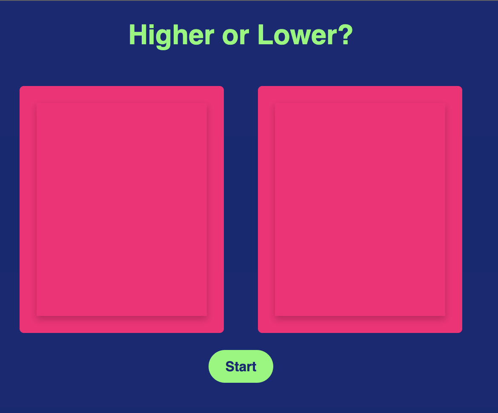
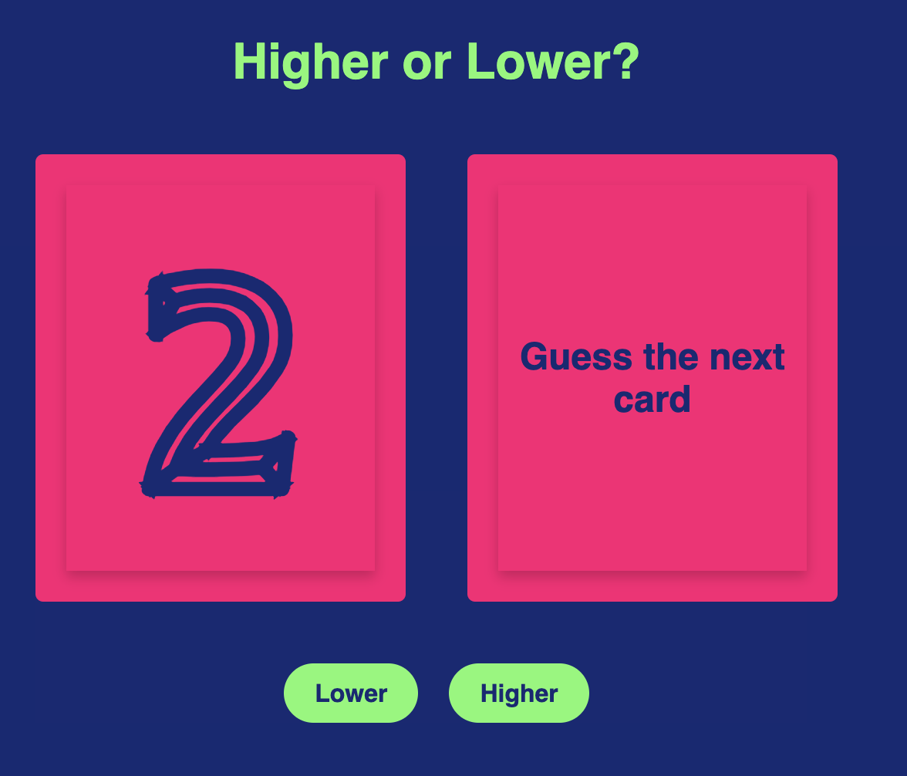
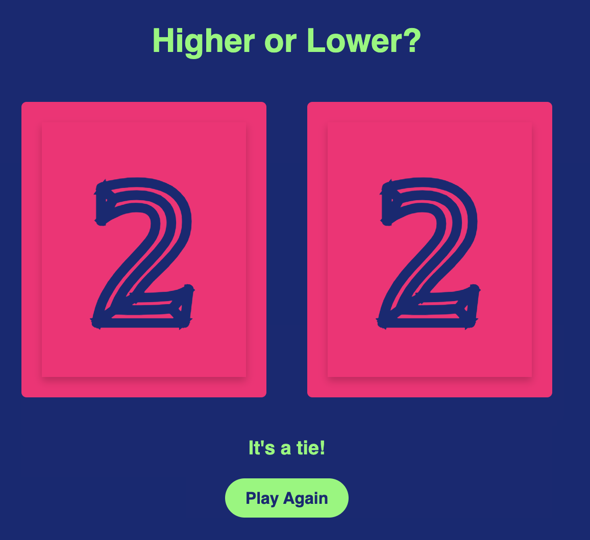

# Higher or Lower

## Description

Guess if the next number is higher or lower.

Quick practice of JavaScript skills.

## Usage

Click start to begin the game.

Guess if the next number is higher or lower.

See the result and choose to play again.

## License

MIT License

## Deployed Application Link

Paste your deployed application link here.

https://scelsic2.github.io/higher-or-lower/
